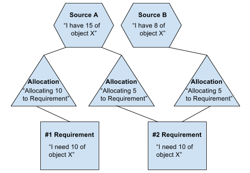

# Stock allocation


## Introduction

What is an Allocation? As its name suggests, Allocations are objects that "allocate" or assign items to requests. A
little vague, so here's an example. Don't worry if you don't know all the key terminologies, they'll be elaborated
later on.

#### Example:

```
Work Order 424242 requires 10 Power Jacks (with the SKU CON100) to complete the order. Innerstep manufacturer
has 15 Power Jacks in total to be used. So Work Order 424242's Allocation assigns 10 of the 15 Power Jacks to its order.
But the parts are all the way down in California so for now the Power Jacks stay where they are.

Work Order 123210 requires 7 Power Jacks to complete the order. Innerstep manufacture has 15 Power Jacks, but 10 have
already been allocated to Work Order 424242, so unfortunately there are only 5 to spare for this work order. Luckily
TechnologyDrive happens to have 5 Power Jacks in stock and the other 2 Power Jacks Work Order 123210 needed can be taken
from TechnologyDrive.
```

In that example lies basically all that will be explained for the rest of the document. There are 3 main components that
are key to understanding allocations: Sources, Requirements and Allocations themselves. In the next section we'll move
onto discussing each of the components that are responsible for the different parts brought up in the example.


## Components and their job

### Source

The first component we will elaborate upon will be Sources. When a customer makes a purchase, the COM must be assembled
at a warehouse and the parts of the COM must come from somewhere. This might be where you think "Oh, the origins of the
parts must come from a Source." Yes and no. While it is true Sources are where the parts originate from, it's likely
not the way you're imagining it. A Source can only provide a limited collection of a single stock item that are all the
same version, from the same location, and of the same customization.

Allow me to reword a little for those I have confused with this example below.

#### Example

```
Gumstix gets its inventory from several manufacturers. These manufacturers can be responsible for providing Gumstix's
several different items. Let's say for now we only have two manufactures that we deal with which I am creatively going
to name Manufacturer #1 and Manufacturer #2. Manufacturer #1 provides us Item A, and Item B. Manufacturer #2 provides us
with Item A and Item C. A Source will be a quantity (unspecified in this example) of one of the Items: A, B, C. If a
Source's stock item is Item A, then all of Item A is either from Manufacturer #1 or #2, not both.
```

So there you have it, Sources are the origin of all the parts used during assembly. As to how they connect to Allocations
and Requirements please read on.


### Requirement

To understand what a Requirement is, we need to have an inkling about another object, StockConsumer. A StockConsumer is
basically a work order or sales order detail, which contains Requirements. A Requirement is the type of stock item
needed to complete the StockConsumer as well as the quantity needed to fulfil the order. A StockConsumer can have many,
MANY StockItem Requirements. But a Requirement can have only one StockItem, albeit a lot of that one StockItem.

#### Example

```
Work Order 320935 requires 20 USB Mini-B Jack (CON130) and 34 Switch(Reset) (S010). In this example there are two
Requirements, one for stockItem CON130 with a unitQtyNeeded of 20 and another for stockItem S010 with unitQtyNeeded of 34.
```


### Allocation

This is the bridge between a Source and Requirement. As mentioned in the introduction Allocations are assigners. What
do they assign? They assign parts of a Source to a Requirement. Requirements complain about needing a StockItem and
Allocations are the work mules that go inquire the Source if they have any StockItems for use and then they reserve the
StockItems for the Requirement.


## Relationships

Shown in the handy diagram below are the relationships of the 3 main components discussed above.



A Source can have many Allocations that map to a Requirement. A Requirement can have many Allocations, each mapping to a
different Source. What should be noted is that a single Allocation can only be mapped between ONE Source and ONE
Requirement.

Sources have more than one Allocation to handle because there are multiple work orders that must be dealt. Because
many Allocations are requesting items from the Source, the Source must keep track of how many items it has reserved.
From the reserved items and the total number of items the Source started with, the Source can inform all the Allocation
how many free items it has to give to the Requirement.

This is why in turn a Requirement can have more than one Allocation despite the fact that it's one StockItem per
Requirement. In the case where one Source runs out of free unallocated items to give the Requirement can turn to other
Sources to fulfill its needs.
